# E-FINE: Online Traffic Fine Payment System

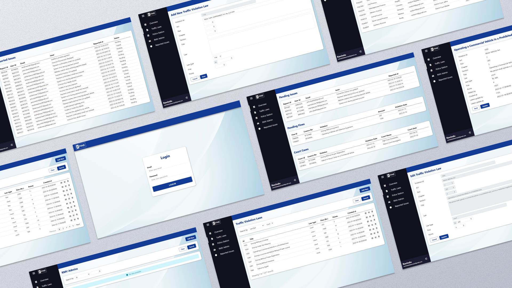

E-FINE is a web-based application that aims to simplify the process of paying traffic fines online. With E-FINE, users can conveniently pay their traffic fines from the comfort of their homes, reducing the need for physical visits to traffic police stations.

## Features

- **Dashboard**: The system admin is provided with a comprehensive dashboard that offers an overview of the system's performance, traffic violation statistics, and pending payments.
- **Manage Traffic Violation Laws**: The system admin can easily manage the traffic violation laws by adding, updating, or deleting them. This feature ensures that the system stays up-to-date with the latest regulations.
- **Manage Police Station Admins**: The system admin has the authority to manage the police station admins. This includes adding, modifying, or removing admin accounts, ensuring proper access control and security.
- **Manage RMV Admins**: The system admin can also manage the RMV (Registration of Motor Vehicles dept) admins. This feature allows for efficient coordination and collaboration between the traffic police and the RMV.

## Technologies Used

- **HTML**: The foundation of the web pages and structure of the E-FINE application.
- **CSS**: Used for styling the web pages, ensuring an appealing and user-friendly interface.
- **LESS**: A CSS preprocessor that simplifies the development process by providing advanced features like variables, mixins, and nesting.
- **JavaScript**: Used for adding interactivity and dynamic behavior to the application.
- **PHP**: Server-side scripting language utilized for handling backend functionalities and connecting with the database.
- **MySQL**: The chosen database management system for storing and retrieving data efficiently.

## Getting Started

To get a local copy of the E-FINE application up and running, follow these steps:

1. Clone the repository:

   ```bash
   git clone https://github.com/lahiru1115/E-FINE.git
   ```

2. Configure the web server environment (e.g., WampServer, XAMPP) to point to the cloned project directory.

3. Import the provided SQL dump file (`efine.sql`) into your MySQL database.

4. Configure the database connection parameters in the `db_conn.php` file, located in the [config](config) directory.

5. Access the application through your web browser using the configured server URL.

## Screenshots

<table>
  <tr>
    <td>
      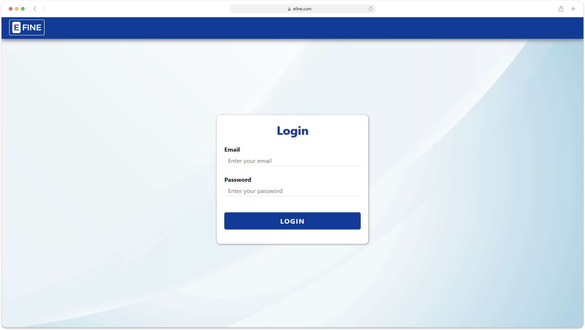
    </td>
    <td>
      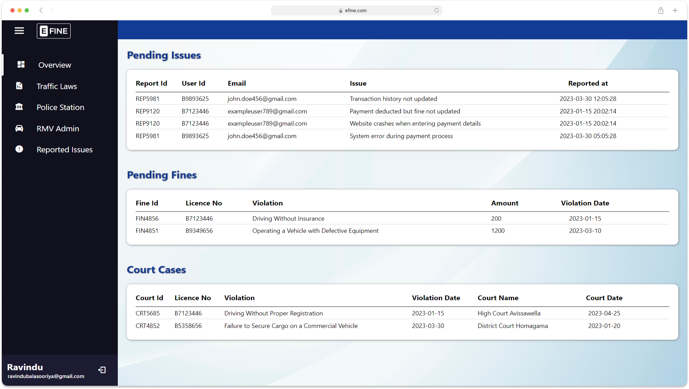
    </td>
  </tr>
  <tr>
    <td>
      
    </td>
    <td>
      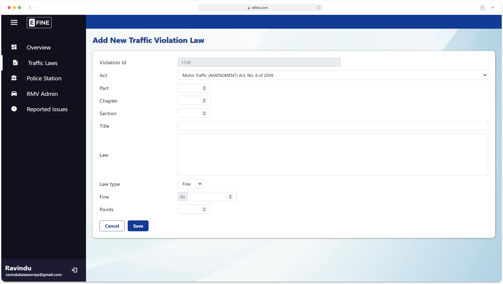
    </td>
  </tr>
  <tr>
    <td>
      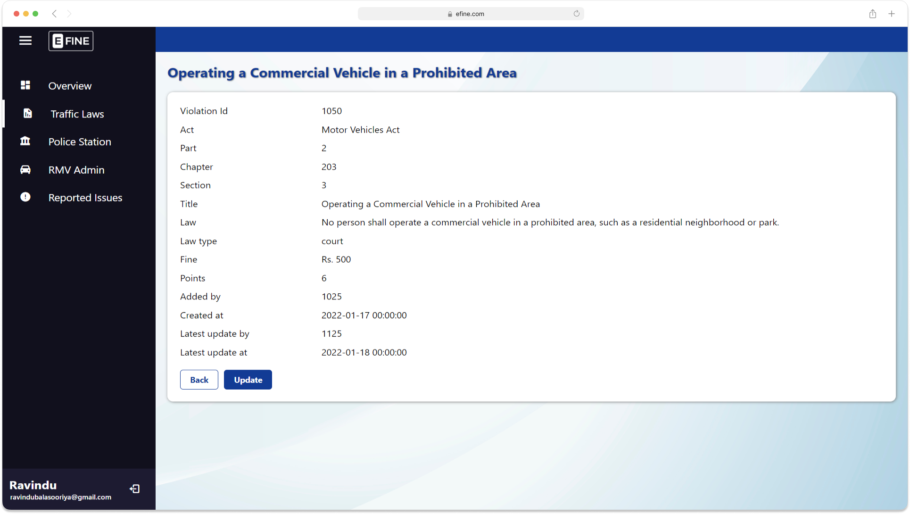
    </td>
    <td>
      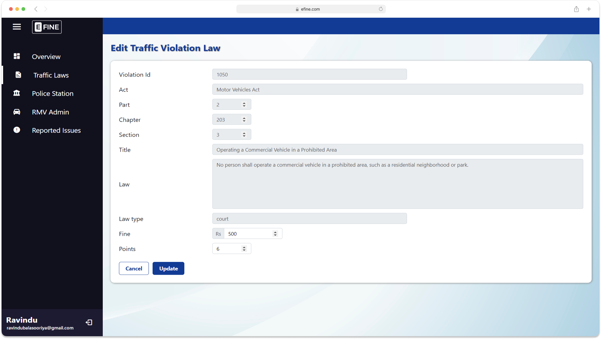
    </td>
  </tr>
  <tr>
    <td>
      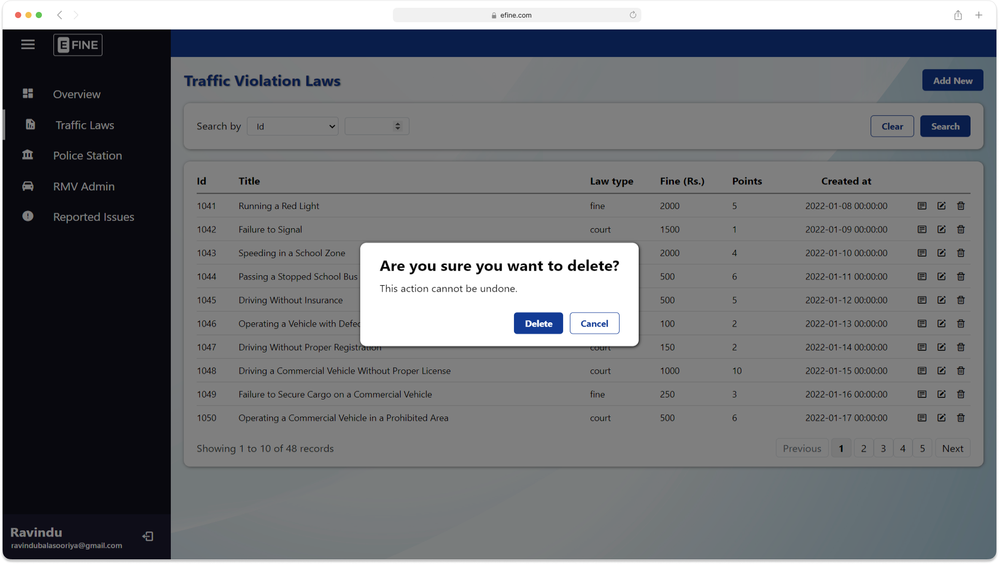
    </td>
    <td>
      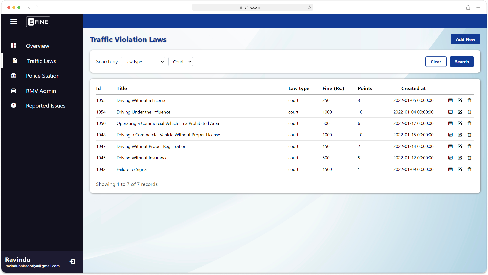
    </td>
  </tr>
  <tr>
    <td>
      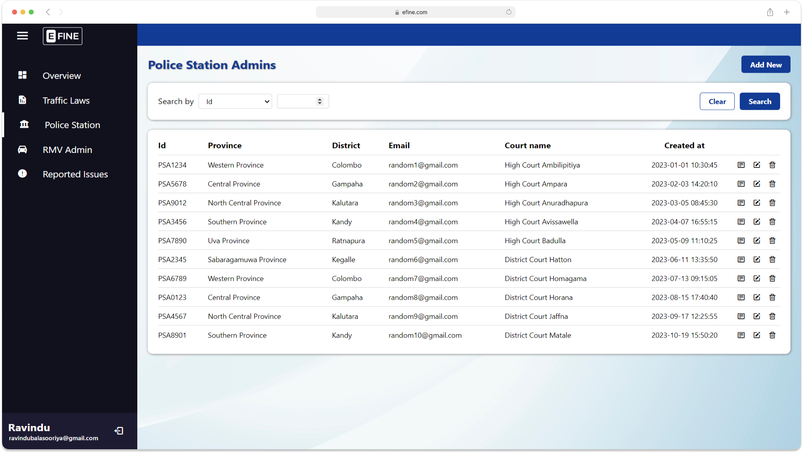
    </td>
    <td>
      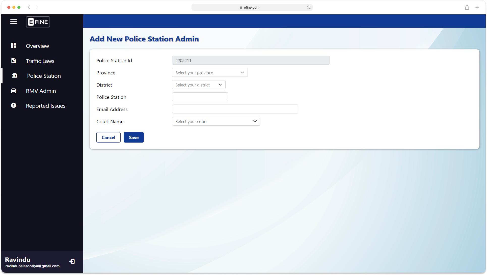
    </td>
  </tr>
  <tr>
    <td>
      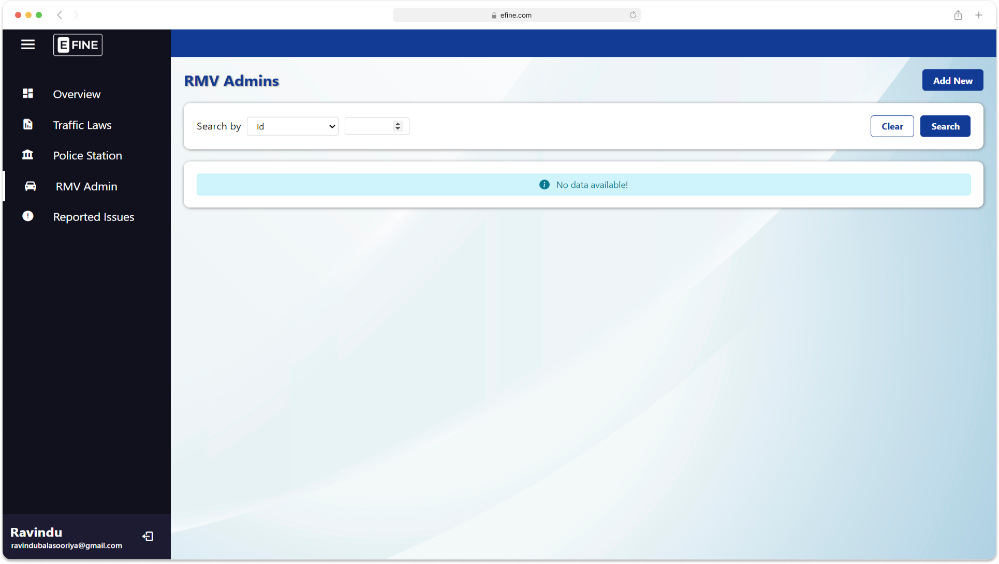
    </td>
    <td>
      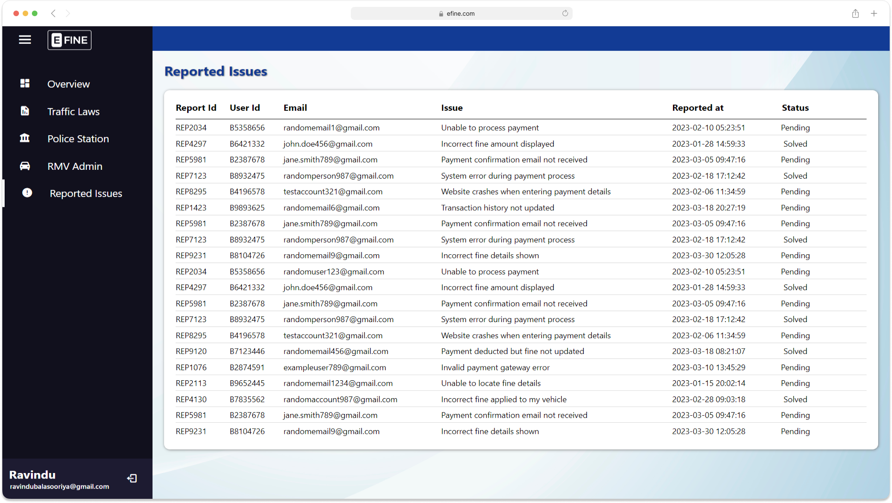
    </td>
  </tr>
</table>

## Contributing

Contributions are welcome! If you'd like to contribute to E-FINE, please follow these guidelines:

1. Fork the repository.

2. Create a new branch for your feature/bug fix.

3. Commit your changes with descriptive commit messages.

4. Push your branch to your forked repository.

5. Submit a pull request to the main repository, explaining the changes you've made.

## Contact

For any inquiries or support regarding E-FINE, please reach out to the project maintainer:

- Name: [Lahiru Dissanayake](https://github.com/lahiru1115)
- Email: [lahirudissanayake15@gmail.com](mailto:lahirudissanayake15@gmail.com)

Feel free to report any issues or suggest enhancements via the [issue tracker](https://github.com/lahiru1115/E-FINE/issues).
